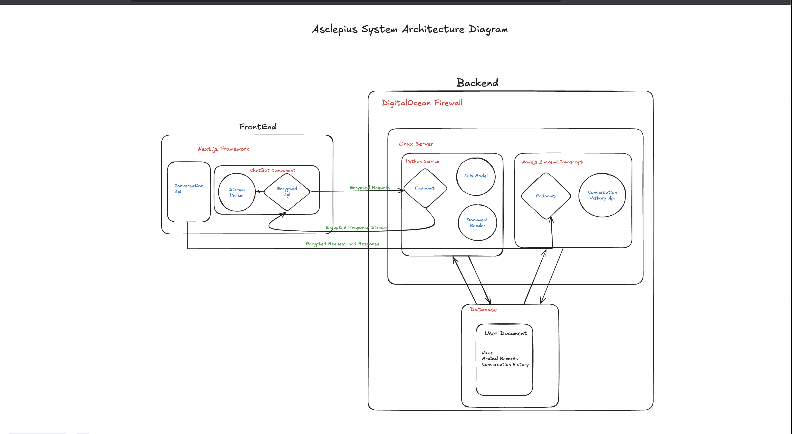

# Asclepius AI Technical Architecture

## Abstract

Asclepius AI represents an advanced intersection of blockchain technology, artificial intelligence, and next-generation web development frameworks. Leveraging **Next.js** for high-performance frontend rendering, **DigitalOcean** infrastructure for secure and scalable backend operations, and sophisticated encryption protocols, the system ensures secure handling of sensitive health data and autonomous reward mechanisms powered by the native **ASCAI token**.

This paper explores the intricacies of Asclepius AI’s technological stack and its mechanisms for safeguarding data privacy, integrating personalized health insights, and incentivizing healthy behaviors.

---

## Frontend Implementation (Next.js)

The frontend of Asclepius AI is engineered using **Next.js**, a robust React-based framework optimized for server-side rendering, static site generation, and seamless integration of dynamic APIs. It comprises three primary components:

### 1. Chatbot Component

- Captures user queries and forwards encrypted requests to the backend health model.
- Uses **AES-256 encryption** for secure data transmission.
- Stream parsing ensures fast, efficient conversational response delivery.

### 2. Data Upload Module

- Allows users to securely upload health documents (e.g., genetic and blood reports).
- Files undergo **client-side RSA encryption** before being transmitted.
- Documents are stored in an encrypted database, forming a memory base for dynamic AI personalization.

### 3. Health Dashboard

- Aggregates data from wearables, reports, and lifestyle inputs.
- Uses encrypted channels to relay data for backend analysis.
- Displays real-time analytics across cardiovascular, renal, digestive, and hepatic indicators.

---

## Backend Infrastructure (DigitalOcean)

The backend is hosted on **DigitalOcean**, using scalable Linux servers behind firewalls to ensure data protection and reliability.

### 1. Python-based Health Model Service

- Core AI engine built in Python using **custom-trained LLMs**.
- Parses uploaded documents to extract relevant biomarkers and genetic data.
- Supports microservice architecture for contextual AI responses.

### 2. Node.js Microservices

- Handles database interactions and persistent conversation history.
- Event-driven, asynchronous architecture ensures responsive user experiences.

---

## Data Encryption and Storage

- Health documents and chats are secured with **AES and RSA** encryption.
- Stored in distributed databases protected by strict access controls and cryptographic hashing.
- Decryption is runtime-only and confined to secure environments.

---

## LLM Integrations and AI Model

- Integrates advanced transformer models like **GPT-4 derivatives** and **BioBERT**.
- Trained on biomedical datasets and clinical protocols.
- Fine-tuned with **Reinforcement Learning with Human Feedback (RLHF)**.
- Personalization improves with user-uploaded health data.

---

## ASCAI Token Integration

The **ASCAI token** serves both as an access gate and reward currency:

- Unlocks premium recommendations and enhanced features.
- RL-driven reward system allocates tokens based on user behavior.

#### Rewards include:

- ✅ Uploading verified health reports  
- ✅ Meaningful chatbot engagement  
- ✅ Positive community contributions  
- ✅ Consistent health improvements tracked via wearable devices  

---

## Conclusion

Asclepius AI showcases a seamless fusion of **blockchain**, **AI**, and **modern web frameworks**, delivering scalable, secure, and personalized digital healthcare. With robust encryption, LLM-driven personalization, and a tokenized incentive system, Asclepius AI aims to transform the healthcare model from reactive treatment to proactive wellness.

